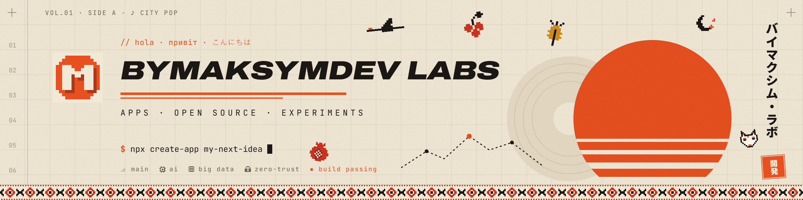

<div align="center">



# Maksym Ostapenko

**Frontend Engineer** &nbsp;·&nbsp; Málaga, Spain

Angular applications for enterprise clients — and the tooling that keeps them fast.

[](https://es.linkedin.com/in/maksym-ostapenko-798228210)
[](https://www.npmjs.com/~bymaksym)
[](https://discord.gg/ctDJjFF9yT)

</div>

---

### About

Frontend engineer building Angular applications for enterprise clients — from the first line
through to production, and keeping the older ones running. I also look after what surrounds them:
tests, CI/CD, automated releases and error monitoring, with Java and Spring Boot when the backend
needs a hand.

Outside work I build tools I actually use: **Loadline** tells you what each screen of a web app
really downloads, so you can fix it before it ships, and **Waypack** is an Android app for packing
by day, by bag and by person.

### Selected work

<p align="center">
  <a href="https://github.com/bymaksym/LoadLine"></a>
  <a href="https://github.com/bymaksym/waypack"></a>
</p>

#### [Loadline](https://github.com/bymaksym/LoadLine) &nbsp;·&nbsp; `@bymaksym/loadline`

[](https://www.npmjs.com/package/@bymaksym/loadline)
[](https://github.com/bymaksym/LoadLine/actions/workflows/ci.yml)
[](https://github.com/bymaksym/LoadLine/blob/main/LICENSE)

Bundle analysers report what each chunk weighs. Loadline reports what each **screen** costs: it walks the
import graph of your build, separates the bootstrap everyone downloads from the code a single route adds,
and counts how many round trips a screen takes to arrive.

One tool, two front doors — a single HTML page that runs offline in your browser, and a command for your
pipeline. Same code, same numbers. Zero runtime dependencies, nothing uploaded, nothing fetched.

```console
$ npx @bymaksym/loadline dist/app/browser
```

#### [Waypack](https://github.com/bymaksym/waypack) &nbsp;·&nbsp; Android

[](https://github.com/bymaksym/waypack/releases/latest)
[](https://github.com/bymaksym/waypack)
[](https://github.com/bymaksym/waypack)

A packing and trip organizer: what to bring, by day, by bag and by person. Two checks instead of
one — *prepared* and *actually in the bag* — so what you found but left on the table still
shows up before you leave.

The domain is plain Kotlin Multiplatform, so it can travel to iOS without a rewrite, and it ships
in four languages from the first release.

### Stack

|                        |                                                                                                              |
| :--------------------- | :----------------------------------------------------------------------------------------------------------- |
| **Core**               |      |
| **Frontend**           | Signals · Standalone components · PrimeNG · Reactive Forms · REST APIs · Component library design               |
| **Quality & delivery** | GitLab CI/CD · Semantic Release · Sentry · ESLint · Stylelint · Prettier · Husky · commitlint · Renovate        |
| **Also**               | Kotlin · Jetpack Compose · Kotlin Multiplatform · Java · Spring Boot · React · Docker · Firebase             |
